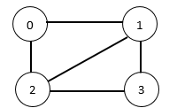

# Galaxy Visiting

Your team was able to find a group of wormholes connecting galaxies with each other.
Starting from our galaxy you wish to visit each galaxy exactly once 
and then return to our galaxy. Some galaxies pairs are connected via a wormhole 
directly, and some are not. Your goal is to start at our galaxy, 
pass each galaxy exactly once and finish at our galaxy.

The galaxies are represented as vertices in a graph and wormholes are represented as edges in an undirected graph. 
Given the graph, output 1 if such cycle exists and 0 otherwise.

You are required to answer the question above using brute force implemented using recursion.

**Input Format**

- The first line will contain N, the number of galaxies (vertices).
- The second line will contain E, the number of wormholes (edges).
- The next E lines will contain an edge each. Each line will contain two space-separated numbers representing the vertices connected with the edge


**Constraints**

- Number of galaxies - including ours - varies between 1 and 10.
- Our galaxy is always vertex 0
- Edges varies between 0 and (N*(N-1))/2

**Output Format**

- 1 if the trip is possible 0 otherwise.

**Sample Input 0**
```
4
5
0 1
0 2
1 2
1 3
2 3
```

**Sample Output 0**

```
1
```

**Explanation 0**

This input corresponds to the following



The trip taken is 0 -> 1 -> 3 -> 2 -> 0. Other cycles exist.