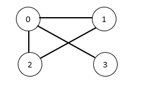

# [Full Synergy Team](https://www.hackerrank.com/contests/cmpn302-fall2021-lab1/challenges/full-synergy-team)

You are a team coach and want to choose a team with the maximum full synergy possible. Players in your team are represented as vertices and synergy is represented as edges in an undirected graph. If there is an edge between two players, this means there is synergy between them. The team with maximum full synergy requires that each pair of players in the team has a synergy edge. You are required, given a graph, to output the size of the team satisfying the maximum full synergy constraint using non-optimized brute force solution.

**Input Format**

- The first line will contain N, the number of players (vertices).
- The second line will contain E, the number of synergy edges (edges).
- The next E lines will contain an edge each. Each line will contain two space-separated numbers representing the vertices connected with the edge. (Hint: you can input this numbers using cin normally. “cin >> var1 >> var2)

**Constraints**

- Number of vertices is from 1 to 17.
- The output team size will vary between 1 to number of vertices.
- Edges varies between 0 and (N*(N-1))/2

**Output Format**

- The maximum size of a team in one line.

**Sample Input 0**
```
4
4
0 1
0 2
0 3
1 2
```

**Sample Output 0**
```
3
```

**Explanation 0**

This input corresponds to the following graph

