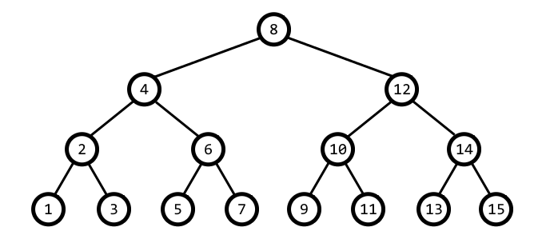

# The Penguin and perfect trees

Bob the penguin has been recently interested in trees, but he has just found out about the perfect binary tree* and he became obsessed with it. Every day he draw a perfect binary tree and write down its inorder traversal in a seperate paper, but unfortunately he lost all his tree drawings and all he has now is the inorder traversal of this trees. Can you help him reconstruct this trees?

*A perfect binary tree is a binary tree in which all interior nodes have two children and all leaves have the same depth or same level



**Input Format**

The first line contains N the number of nodes and the next line contains N space separated numbers represent the inorder traversal of the tree

**Constraints**

1 <= N < 2^17

**Output Format**

print the tree level by level and print each level from left to right

for example the above tree should be printted 8 4 12 2 6 10 14 1 3 5 7 9 11 13 15

**Sample Input 0**

```
15

9 8 5 2 1 4 7 6 3 10 13 12 15 11 14
```
**Sample Output 0**
```
6 2 12 8 4 10 11 9 5 1 7 3 13 15 14 
```
