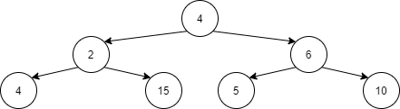

# [Subtrees With Similar Size and Sum](https://www.hackerrank.com/contests/cmpn302-fall2021-hw3/challenges/subtrees-with-similar-size-and-sum)

Given a binary tree determine if there exist two or more subtrees of size bigger than M that have the exact summation and exact size. You are allowed to use unordered_map and unordered_set if needed

**Input Format**

- The first line will contain the number of nodes in the tree N and the size M.
- The following N numbers will contain the data in each node.
- The next line will contain the number of edges in the tree E.
- The following E lines will contain 3 values:
- L or R to represent of this is a left or right child
- Index of the parent.
- Index of the child.

**Constraints**

- N is between 1 and 10^6
- Node 0 is always the root
- Node values are between 1 and 10^4


**Output Format**

One line containing 0 if no such subtrees exist and 1 otherwise.


**Sample Input 0**
```
7 1
4 2 6 4 15 5 10
6
L 0 1
R 0 2
L 1 3
R 1 4
L 2 5
R 2 6
```
**Sample Output 0**
```
1
```

**Explanation 0**

There exist two subtrees of size 3 with sum of 21. (2,4,15) and (6,5,10)



